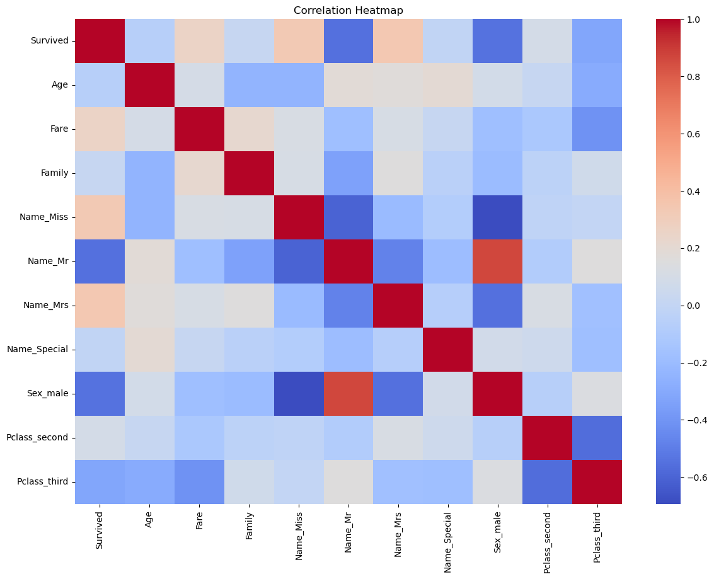
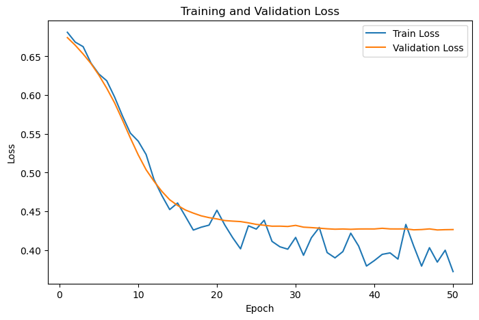

# Titanic: Machine Learning from Disaster

Classification with Decision Trees, Ensemble Models and Neural Networks

## Instructions

Train various machine learning models for the binary classification task provided in the [Titanic: Machine Learning from Disaster](https://www.kaggle.com/c/titanic) competition. Note: we will play loosely with the terms validation and test sets and may even use them interchangeably. This Kaggle competition has its own Test set file that we can make predications on and submit for scoring, for now, our "test" set could be viewed as a validation set.

The task is to predict whether an individual would survive the famous disaster. There are 11 input variables, and 2 output labels: **survived** or **did not survive**.

*Note: you may need to install XGBoost*

#!pip install xgboost


```python
import pandas as pd
import numpy as np
import matplotlib.pyplot as plt
import seaborn as sns

from sklearn import tree
from sklearn.preprocessing import StandardScaler
from sklearn.model_selection import train_test_split, GridSearchCV
from sklearn.metrics import accuracy_score, roc_auc_score
from sklearn.decomposition import PCA

from xgboost import XGBClassifier

import torch
from torch import nn
from torch import optim
from torch.utils.data import Dataset, DataLoader, TensorDataset
import torch.nn.functional as F
import torch.nn.utils as utils

seed = 42
np.random.seed(seed)
torch.manual_seed(seed)

device = torch.device('cuda' if torch.cuda.is_available() else 'cpu')
device
```


    device(type='cpu')


# Data Loading and Exploration

`https://www.kaggle.com/competitions/titanic` contains data on passengers of the famous Titanic disaster. The task is to examine and predict what sorts of people were more likely to survive using data on their name, age, gender, socio-economic class, etc.

#### 1. Loading our Data
Load the train data into a pandas DataFrames. Display the first few rows **of each DataFrame** and print the shape of the dataframe.


```python

# Load the train data into a pandas DataFrames
train = pd.read_csv("train.csv")

train.head(10)

# print("Shape of the dataframe:", train.shape)
```


<div>
<style scoped>
    .dataframe tbody tr th:only-of-type {
        vertical-align: middle;
    }

    .dataframe tbody tr th {
        vertical-align: top;
    }

    .dataframe thead th {
        text-align: right;
    }
</style>
<table border="1" class="dataframe">
  <thead>
    <tr style="text-align: right;">
      <th></th>
      <th>PassengerId</th>
      <th>Survived</th>
      <th>Pclass</th>
      <th>Name</th>
      <th>Sex</th>
      <th>Age</th>
      <th>SibSp</th>
      <th>Parch</th>
      <th>Ticket</th>
      <th>Fare</th>
      <th>Cabin</th>
      <th>Embarked</th>
    </tr>
  </thead>
  <tbody>
    <tr>
      <th>0</th>
      <td>1</td>
      <td>0</td>
      <td>3</td>
      <td>Braund, Mr. Owen Harris</td>
      <td>male</td>
      <td>22.0</td>
      <td>1</td>
      <td>0</td>
      <td>A/5 21171</td>
      <td>7.2500</td>
      <td>NaN</td>
      <td>S</td>
    </tr>
    <tr>
      <th>1</th>
      <td>2</td>
      <td>1</td>
      <td>1</td>
      <td>Cumings, Mrs. John Bradley (Florence Briggs Th...</td>
      <td>female</td>
      <td>38.0</td>
      <td>1</td>
      <td>0</td>
      <td>PC 17599</td>
      <td>71.2833</td>
      <td>C85</td>
      <td>C</td>
    </tr>
    <tr>
      <th>2</th>
      <td>3</td>
      <td>1</td>
      <td>3</td>
      <td>Heikkinen, Miss. Laina</td>
      <td>female</td>
      <td>26.0</td>
      <td>0</td>
      <td>0</td>
      <td>STON/O2. 3101282</td>
      <td>7.9250</td>
      <td>NaN</td>
      <td>S</td>
    </tr>
    <tr>
      <th>3</th>
      <td>4</td>
      <td>1</td>
      <td>1</td>
      <td>Futrelle, Mrs. Jacques Heath (Lily May Peel)</td>
      <td>female</td>
      <td>35.0</td>
      <td>1</td>
      <td>0</td>
      <td>113803</td>
      <td>53.1000</td>
      <td>C123</td>
      <td>S</td>
    </tr>
    <tr>
      <th>4</th>
      <td>5</td>
      <td>0</td>
      <td>3</td>
      <td>Allen, Mr. William Henry</td>
      <td>male</td>
      <td>35.0</td>
      <td>0</td>
      <td>0</td>
      <td>373450</td>
      <td>8.0500</td>
      <td>NaN</td>
      <td>S</td>
    </tr>
    <tr>
      <th>5</th>
      <td>6</td>
      <td>0</td>
      <td>3</td>
      <td>Moran, Mr. James</td>
      <td>male</td>
      <td>NaN</td>
      <td>0</td>
      <td>0</td>
      <td>330877</td>
      <td>8.4583</td>
      <td>NaN</td>
      <td>Q</td>
    </tr>
    <tr>
      <th>6</th>
      <td>7</td>
      <td>0</td>
      <td>1</td>
      <td>McCarthy, Mr. Timothy J</td>
      <td>male</td>
      <td>54.0</td>
      <td>0</td>
      <td>0</td>
      <td>17463</td>
      <td>51.8625</td>
      <td>E46</td>
      <td>S</td>
    </tr>
    <tr>
      <th>7</th>
      <td>8</td>
      <td>0</td>
      <td>3</td>
      <td>Palsson, Master. Gosta Leonard</td>
      <td>male</td>
      <td>2.0</td>
      <td>3</td>
      <td>1</td>
      <td>349909</td>
      <td>21.0750</td>
      <td>NaN</td>
      <td>S</td>
    </tr>
    <tr>
      <th>8</th>
      <td>9</td>
      <td>1</td>
      <td>3</td>
      <td>Johnson, Mrs. Oscar W (Elisabeth Vilhelmina Berg)</td>
      <td>female</td>
      <td>27.0</td>
      <td>0</td>
      <td>2</td>
      <td>347742</td>
      <td>11.1333</td>
      <td>NaN</td>
      <td>S</td>
    </tr>
    <tr>
      <th>9</th>
      <td>10</td>
      <td>1</td>
      <td>2</td>
      <td>Nasser, Mrs. Nicholas (Adele Achem)</td>
      <td>female</td>
      <td>14.0</td>
      <td>1</td>
      <td>0</td>
      <td>237736</td>
      <td>30.0708</td>
      <td>NaN</td>
      <td>C</td>
    </tr>
  </tbody>
</table>
</div>


#### 2. Checking for Null Values

Check for null values in the training data.


```python

train.isnull().sum()
```


    PassengerId      0
    Survived         0
    Pclass           0
    Name             0
    Sex              0
    Age            177
    SibSp            0
    Parch            0
    Ticket           0
    Fare             0
    Cabin          687
    Embarked         2
    dtype: int64


#### 3. Checking the class balance
Since this is a binary classification task, class balance is extremely important. What percent of the training data belongs to each class? Is this roughly balanced?


```python

# train['Survived'].value_counts(normalize=True) * 100
class_percent = train['Survived'].value_counts(normalize=True) * 100

print(class_percent)
```

    Survived
    0    61.616162
    1    38.383838
    Name: proportion, dtype: float64
    

Classes are roughly balanced, about a 60-40 split between not surviving and surviving.

# Feature Engineering

1. Fill missing values for Age and Fare with their respective median values, make sure to round age.


```python

median_age = train['Age'].median()
# type(median_age)

median_fare = train['Fare'].median()

# Fill missing values for age with median values
train['Age'] = train['Age'].fillna(round(median_age)).astype(int)

# Fill missing values for Fare with median values
train['Fare'] = train['Fare'].fillna(median_fare)

train.isnull().sum()

```


    PassengerId      0
    Survived         0
    Pclass           0
    Name             0
    Sex              0
    Age              0
    SibSp            0
    Parch            0
    Ticket           0
    Fare             0
    Cabin          687
    Embarked         2
    dtype: int64


2. Drop non-unique variables such as `PassengerId`, and irrelevant features such as `Ticket`, `Cabin`, and `Embarked`.


```python

# train.columns
# train.drop(['PassengerId'], axis=1)

# Drop non-unique variables and irrelevant features
to_drop = ['PassengerId', 'Ticket', 'Cabin', 'Embarked']
train = train.drop(columns=to_drop)

train.columns
```


    Index(['Survived', 'Pclass', 'Name', 'Sex', 'Age', 'SibSp', 'Parch', 'Fare'], dtype='object')


3. Combine `SibSp` and `Parch` into a single variable `Family`. Then drop `SibSp` and `Parch`.


```python

# train[['SibSp', 'Parch']].head()

# Combine SibSp and Parch
train['Family'] = train['SibSp'] + train['Parch']
# drop SibSp and Parch
train.drop(columns=['SibSp', 'Parch'], inplace=True)

train.head()
```


<div>
<style scoped>
    .dataframe tbody tr th:only-of-type {
        vertical-align: middle;
    }

    .dataframe tbody tr th {
        vertical-align: top;
    }

    .dataframe thead th {
        text-align: right;
    }
</style>
<table border="1" class="dataframe">
  <thead>
    <tr style="text-align: right;">
      <th></th>
      <th>Survived</th>
      <th>Pclass</th>
      <th>Name</th>
      <th>Sex</th>
      <th>Age</th>
      <th>Fare</th>
      <th>Family</th>
    </tr>
  </thead>
  <tbody>
    <tr>
      <th>0</th>
      <td>0</td>
      <td>3</td>
      <td>Braund, Mr. Owen Harris</td>
      <td>male</td>
      <td>22</td>
      <td>7.2500</td>
      <td>1</td>
    </tr>
    <tr>
      <th>1</th>
      <td>1</td>
      <td>1</td>
      <td>Cumings, Mrs. John Bradley (Florence Briggs Th...</td>
      <td>female</td>
      <td>38</td>
      <td>71.2833</td>
      <td>1</td>
    </tr>
    <tr>
      <th>2</th>
      <td>1</td>
      <td>3</td>
      <td>Heikkinen, Miss. Laina</td>
      <td>female</td>
      <td>26</td>
      <td>7.9250</td>
      <td>0</td>
    </tr>
    <tr>
      <th>3</th>
      <td>1</td>
      <td>1</td>
      <td>Futrelle, Mrs. Jacques Heath (Lily May Peel)</td>
      <td>female</td>
      <td>35</td>
      <td>53.1000</td>
      <td>1</td>
    </tr>
    <tr>
      <th>4</th>
      <td>0</td>
      <td>3</td>
      <td>Allen, Mr. William Henry</td>
      <td>male</td>
      <td>35</td>
      <td>8.0500</td>
      <td>0</td>
    </tr>
  </tbody>
</table>
</div>


The `Name` column contains passengers' full names, including their titles (e.g., Mr., Mrs., Dr., Col.). Write code to **extract only the title** from each passenger's name. Standardize similar titles (e.g., Ms --> Miss, Mlle --> Miss, Mme --> Mrs), and group rare or honorific titles (e.g., Capt, Col, Dr, Sir, etc.) under a single label called "Special".


```python
special_names = ['Capt','Col','Countess','Don','Dona','Dr','Jonkheer','Lady','Major','Rev','Sir']
train['Name'] = train.Name.str.extract(' ([A-Za-z]+)\.', expand=False)
train['Name'] = train['Name'].replace('Ms', 'Miss').replace('Mlle', 'Miss').replace('Mme', 'Mrs').replace(special_names, 'Special')

train.head()
```


<div>
<style scoped>
    .dataframe tbody tr th:only-of-type {
        vertical-align: middle;
    }

    .dataframe tbody tr th {
        vertical-align: top;
    }

    .dataframe thead th {
        text-align: right;
    }
</style>
<table border="1" class="dataframe">
  <thead>
    <tr style="text-align: right;">
      <th></th>
      <th>Survived</th>
      <th>Pclass</th>
      <th>Name</th>
      <th>Sex</th>
      <th>Age</th>
      <th>Fare</th>
      <th>Family</th>
    </tr>
  </thead>
  <tbody>
    <tr>
      <th>0</th>
      <td>0</td>
      <td>3</td>
      <td>Mr</td>
      <td>male</td>
      <td>22</td>
      <td>7.2500</td>
      <td>1</td>
    </tr>
    <tr>
      <th>1</th>
      <td>1</td>
      <td>1</td>
      <td>Mrs</td>
      <td>female</td>
      <td>38</td>
      <td>71.2833</td>
      <td>1</td>
    </tr>
    <tr>
      <th>2</th>
      <td>1</td>
      <td>3</td>
      <td>Miss</td>
      <td>female</td>
      <td>26</td>
      <td>7.9250</td>
      <td>0</td>
    </tr>
    <tr>
      <th>3</th>
      <td>1</td>
      <td>1</td>
      <td>Mrs</td>
      <td>female</td>
      <td>35</td>
      <td>53.1000</td>
      <td>1</td>
    </tr>
    <tr>
      <th>4</th>
      <td>0</td>
      <td>3</td>
      <td>Mr</td>
      <td>male</td>
      <td>35</td>
      <td>8.0500</td>
      <td>0</td>
    </tr>
  </tbody>
</table>
</div>


4. One-hot-encode the features `Name`, `Sex`, and `Pclass`.


```python

onehot_cols = ['Name', 'Sex', 'Pclass']
train = pd.get_dummies(train, columns=onehot_cols, drop_first=True)

# change the feature name of Pclass_2 and Pclass_3
train = train.rename(columns={
    'Pclass_2': 'Pclass_second',
    'Pclass_3': 'Pclass_third'
})

train.head()
```


<div>
<style scoped>
    .dataframe tbody tr th:only-of-type {
        vertical-align: middle;
    }

    .dataframe tbody tr th {
        vertical-align: top;
    }

    .dataframe thead th {
        text-align: right;
    }
</style>
<table border="1" class="dataframe">
  <thead>
    <tr style="text-align: right;">
      <th></th>
      <th>Survived</th>
      <th>Age</th>
      <th>Fare</th>
      <th>Family</th>
      <th>Name_Miss</th>
      <th>Name_Mr</th>
      <th>Name_Mrs</th>
      <th>Name_Special</th>
      <th>Sex_male</th>
      <th>Pclass_second</th>
      <th>Pclass_third</th>
    </tr>
  </thead>
  <tbody>
    <tr>
      <th>0</th>
      <td>0</td>
      <td>22</td>
      <td>7.2500</td>
      <td>1</td>
      <td>False</td>
      <td>True</td>
      <td>False</td>
      <td>False</td>
      <td>True</td>
      <td>False</td>
      <td>True</td>
    </tr>
    <tr>
      <th>1</th>
      <td>1</td>
      <td>38</td>
      <td>71.2833</td>
      <td>1</td>
      <td>False</td>
      <td>False</td>
      <td>True</td>
      <td>False</td>
      <td>False</td>
      <td>False</td>
      <td>False</td>
    </tr>
    <tr>
      <th>2</th>
      <td>1</td>
      <td>26</td>
      <td>7.9250</td>
      <td>0</td>
      <td>True</td>
      <td>False</td>
      <td>False</td>
      <td>False</td>
      <td>False</td>
      <td>False</td>
      <td>True</td>
    </tr>
    <tr>
      <th>3</th>
      <td>1</td>
      <td>35</td>
      <td>53.1000</td>
      <td>1</td>
      <td>False</td>
      <td>False</td>
      <td>True</td>
      <td>False</td>
      <td>False</td>
      <td>False</td>
      <td>False</td>
    </tr>
    <tr>
      <th>4</th>
      <td>0</td>
      <td>35</td>
      <td>8.0500</td>
      <td>0</td>
      <td>False</td>
      <td>True</td>
      <td>False</td>
      <td>False</td>
      <td>True</td>
      <td>False</td>
      <td>True</td>
    </tr>
  </tbody>
</table>
</div>


5. Correlation Map
Visualize the correlation between variables using a heatmap. List the 3 features that are most related to a passenger's survival.


```python

train.describe()

plt.figure(figsize=(14, 10))
corr_matrix = train.corr()

sns.heatmap(corr_matrix, cmap='coolwarm', annot=False)
plt.title("Correlation Heatmap")
plt.show()

```


    

    


```python
# List of three features

# train.corr()['Survived'].sort_values(ascending=False).head()

# Drop the target variable itself
corr_survived = train.corr()['Survived'].drop('Survived')

# List the 3 features that are most related to a passenger's survival
corr_survived.sort_values(ascending=False).head(3)
```


    Name_Mrs     0.341994
    Name_Miss    0.335636
    Fare         0.257307
    Name: Survived, dtype: float64


### Checkpoint 1


Your `train.head()` should look like this.


```python
train.head()
```


<div>
<style scoped>
    .dataframe tbody tr th:only-of-type {
        vertical-align: middle;
    }

    .dataframe tbody tr th {
        vertical-align: top;
    }

    .dataframe thead th {
        text-align: right;
    }
</style>
<table border="1" class="dataframe">
  <thead>
    <tr style="text-align: right;">
      <th></th>
      <th>Survived</th>
      <th>Age</th>
      <th>Fare</th>
      <th>Family</th>
      <th>Name_Miss</th>
      <th>Name_Mr</th>
      <th>Name_Mrs</th>
      <th>Name_Special</th>
      <th>Sex_male</th>
      <th>Pclass_second</th>
      <th>Pclass_third</th>
    </tr>
  </thead>
  <tbody>
    <tr>
      <th>0</th>
      <td>0</td>
      <td>22</td>
      <td>7.2500</td>
      <td>1</td>
      <td>False</td>
      <td>True</td>
      <td>False</td>
      <td>False</td>
      <td>True</td>
      <td>False</td>
      <td>True</td>
    </tr>
    <tr>
      <th>1</th>
      <td>1</td>
      <td>38</td>
      <td>71.2833</td>
      <td>1</td>
      <td>False</td>
      <td>False</td>
      <td>True</td>
      <td>False</td>
      <td>False</td>
      <td>False</td>
      <td>False</td>
    </tr>
    <tr>
      <th>2</th>
      <td>1</td>
      <td>26</td>
      <td>7.9250</td>
      <td>0</td>
      <td>True</td>
      <td>False</td>
      <td>False</td>
      <td>False</td>
      <td>False</td>
      <td>False</td>
      <td>True</td>
    </tr>
    <tr>
      <th>3</th>
      <td>1</td>
      <td>35</td>
      <td>53.1000</td>
      <td>1</td>
      <td>False</td>
      <td>False</td>
      <td>True</td>
      <td>False</td>
      <td>False</td>
      <td>False</td>
      <td>False</td>
    </tr>
    <tr>
      <th>4</th>
      <td>0</td>
      <td>35</td>
      <td>8.0500</td>
      <td>0</td>
      <td>False</td>
      <td>True</td>
      <td>False</td>
      <td>False</td>
      <td>True</td>
      <td>False</td>
      <td>True</td>
    </tr>
  </tbody>
</table>
</div>


# Train/Test Split and Feature Scaling

#### 1. Scaling
Scale the train. 


```python
train.dtypes
```


    Survived           int64
    Age                int64
    Fare             float64
    Family             int64
    Name_Miss           bool
    Name_Mr             bool
    Name_Mrs            bool
    Name_Special        bool
    Sex_male            bool
    Pclass_second       bool
    Pclass_third        bool
    dtype: object


```python

# Only scale numeric features
scale_cols = ['Age', 'Fare', 'Family']

scaler = StandardScaler()

# Fit_Transform only the numeric columns
train[scale_cols] = scaler.fit_transform(train[scale_cols])

train.head()
```


<div>
<style scoped>
    .dataframe tbody tr th:only-of-type {
        vertical-align: middle;
    }

    .dataframe tbody tr th {
        vertical-align: top;
    }

    .dataframe thead th {
        text-align: right;
    }
</style>
<table border="1" class="dataframe">
  <thead>
    <tr style="text-align: right;">
      <th></th>
      <th>Survived</th>
      <th>Age</th>
      <th>Fare</th>
      <th>Family</th>
      <th>Name_Miss</th>
      <th>Name_Mr</th>
      <th>Name_Mrs</th>
      <th>Name_Special</th>
      <th>Sex_male</th>
      <th>Pclass_second</th>
      <th>Pclass_third</th>
    </tr>
  </thead>
  <tbody>
    <tr>
      <th>0</th>
      <td>0</td>
      <td>-0.564145</td>
      <td>-0.502445</td>
      <td>0.059160</td>
      <td>False</td>
      <td>True</td>
      <td>False</td>
      <td>False</td>
      <td>True</td>
      <td>False</td>
      <td>True</td>
    </tr>
    <tr>
      <th>1</th>
      <td>1</td>
      <td>0.664649</td>
      <td>0.786845</td>
      <td>0.059160</td>
      <td>False</td>
      <td>False</td>
      <td>True</td>
      <td>False</td>
      <td>False</td>
      <td>False</td>
      <td>False</td>
    </tr>
    <tr>
      <th>2</th>
      <td>1</td>
      <td>-0.256947</td>
      <td>-0.488854</td>
      <td>-0.560975</td>
      <td>True</td>
      <td>False</td>
      <td>False</td>
      <td>False</td>
      <td>False</td>
      <td>False</td>
      <td>True</td>
    </tr>
    <tr>
      <th>3</th>
      <td>1</td>
      <td>0.434250</td>
      <td>0.420730</td>
      <td>0.059160</td>
      <td>False</td>
      <td>False</td>
      <td>True</td>
      <td>False</td>
      <td>False</td>
      <td>False</td>
      <td>False</td>
    </tr>
    <tr>
      <th>4</th>
      <td>0</td>
      <td>0.434250</td>
      <td>-0.486337</td>
      <td>-0.560975</td>
      <td>False</td>
      <td>True</td>
      <td>False</td>
      <td>False</td>
      <td>True</td>
      <td>False</td>
      <td>True</td>
    </tr>
  </tbody>
</table>
</div>


Drop the target from the training data and add it to its own dataframe


```python
target = train['Survived']
train.drop(['Survived'], axis=1, inplace=True)
```

#### 2. Train/Test Split
Split the training data into a train and test set using an 80-20 split. Preserve the balance of the target variable using the `stratify = target` argument.


```python

X_train, X_test, y_train, y_test = train_test_split(
    train,
    target,
    test_size=0.2,
    random_state=42,
    stratify=target
)

```

#### 3. Check the class balance of the train and test set.
Print the percent of samples that survived in both the train and test set. 


```python


print(y_train.value_counts(normalize=True))
print(y_test.value_counts(normalize=True))
```

    Survived
    0    0.616573
    1    0.383427
    Name: proportion, dtype: float64
    Survived
    0    0.614525
    1    0.385475
    Name: proportion, dtype: float64
    

# Q4 - Decision Tree Training

Decision trees have a number of parameters to adjust. Here we use `criterion`, `max_depth`, `max_features`, and `splitter` as the parameters to adjust.

The grid and potential parameter values are defined below. For more information on what these parameters do, see the [documentation](https://scikit-learn.org/stable/modules/generated/sklearn.tree.DecisionTreeClassifier.html).


```python
# Hyper parameters for grid search
param_grid = {'criterion' : ['gini', 'entropy'] # The function to measure the quality of a split.
              , 'max_depth' : [1, 2, 3, 4, 5, None] # None means the tree can grow arbitrarily deep.
              , 'max_features' : [2, 3, 4, 'sqrt', 'log2', None] # The number of features to consider when looking for the best split.
              , 'splitter' : ['best', 'random'] # The strategy used to choose the split at each node.
             }
```

#### 1. Instantiate a `DecisionTreeClassifier` model.


```python

model_tree = tree.DecisionTreeClassifier(random_state=42)
```

#### 2. Conduct the grid search.

Fit the grid search object on the training data and print the best cross-validation score and best parameters. 


```python

grid = GridSearchCV(
    estimator=model_tree,
    param_grid=param_grid,
    scoring='accuracy',
    cv=3,
    n_jobs=-1
)

grid.fit(X_train, y_train)

print(grid.best_score_)
print(grid.best_params_)
```

    0.8314541006275928
    {'criterion': 'gini', 'max_depth': 4, 'max_features': None, 'splitter': 'best'}
    

#### 3. Evaluate on the validation set.
Using the best parameters, evaluate the model on the validation set. Calculate the accuracy and AUC on the validation set.


```python

# Best model from grid search
model_tree = grid.best_estimator_

# Preditions on validation (test) set
y_val_pred = model_tree.predict(X_test)

# Calculate the Accuracy and AUC on the validation set
acc_dt = accuracy_score(y_test, y_val_pred)
auc_dt = roc_auc_score(y_test, y_val_pred)

print(f'Accuracy for Decision Tree:, {acc_dt:.2%}')
print(f'AUC for Decision Tree: {auc_dt:.2f}')
```

    Accuracy for Decision Tree:, 83.80%
    AUC for Decision Tree: 0.82
    

### Checkpoint 2

The accuracy for this decision tree should be between ~70-83%. It it not controlled via a random seed so results will vary!

# Ensemble Models

A single decision tree can be unstable. Use ensemble models to get more accurate predictions. We will train an XGBoost model which combines multiple trees to see if we can get a better performance. As with decision trees, there are a number of tunable parameters, so we will use a grid search to find the "best" ones.


```python
param_grid = {
    'n_estimators': [100, 200, 300],        # number of boosting rounds
    'max_depth': [3, 4, 5, 6],              # depth of each tree
    'learning_rate': [0.01, 0.05, 0.1],     # step size shrinkage
    'subsample': [0.8, 1.0],                # fraction of samples used per tree
    'colsample_bytree': [0.8, 1.0],         # fraction of features used per tree
    'gamma': [0, 0.5, 1],                   # minimum loss reduction to make a split
    'reg_lambda': [1, 5, 10]                # L2 regularization strength
}
```

#### 1. Instantiate an XGBoost model.

```python

xgb = XGBClassifier(random_state = 42, eval_metric='logloss')
```

#### 2. Conduct the grid search.

Fit the grid search object on the training data and print the best cross-validation score and best parameters.


```python

grid = GridSearchCV(
    estimator=xgb,
    scoring='accuracy',
    cv=3,
    param_grid=param_grid,
    n_jobs=-1
)

grid.fit(X_train, y_train)

print(grid.best_score_)
print(grid.best_params_)
```

    0.8384864494320935
    {'colsample_bytree': 0.8, 'gamma': 0, 'learning_rate': 0.01, 'max_depth': 5, 'n_estimators': 200, 'reg_lambda': 1, 'subsample': 0.8}
    

#### 3. Evaluate on the validation set.
Using the best parameters, evaluate the model on the validation (test) set. Calculate the accuracy and AUC score on the validation set.


```python

# Best XGBoost model 
xgb = grid.best_estimator_

# Predit on validation set
y_val_pred = xgb.predict(X_test)

# Compute Accuracy and AUC
acc_xgb = accuracy_score(y_test, y_val_pred)
auc_xgb = roc_auc_score(y_test, y_val_pred)

print(f'Accuracy for XGBoost: {acc_xgb:.2%}')
print(f'AUC for XGBoost: {auc_xgb:.2f}')

```

    Accuracy for XGBoost: 82.68%
    AUC for XGBoost: 0.80
    

### Checkpoint 3

Our XGboost model should be 83.24% accuracy with and AUC of 0.81. This is controlled by a random seed.

# Training a Neural Network

The last model we will train is a Neural Network. The Neural Network (NN) architecture will consist of 4 layers:
1. Input (size = 10)
2. Hidden1 (size = 16)
3. Hidden2 (size = 16)
4. Output layer (size = 1)

This is a simple network that uses Relu activation function on each of the hidden layers, and a Sigmoid function on the output.

Train the model using Binary Cross Entropy Loss for 50 epochs, with an Adam optimizer.

#### 1. Define the NN architecture.

The NN model have 4 layers, with activation functions between each layer.
1. Input layer (linear)
2. Apply ReLU
3. First hidden layer (linear)
4. Apply Relu
5. Second hidden layer (linear)
6. Apply Sigmoid


```python
class Model(nn.Module):
    def __init__(self, input_size, hidden1_size, hidden2_size, output_size):
        # define the NN architecture
        super(Model, self).__init__()

        # Connected layers
        self.fc1 = nn.Linear(input_size, hidden1_size)
        self.fc2 = nn.Linear(hidden1_size, hidden2_size)
        self.fc3 = nn.Linear(hidden2_size, output_size)

        # Activation functions
        self.relu1 = nn.ReLU()
        self.relu2 = nn.ReLU()
        self.sigmoid = nn.Sigmoid()
        

    def forward(self, x):
        x = self.relu1(self.fc1(x))
        x = self.relu2(self.fc2(x))
        x = self.sigmoid(self.fc3(x))
        return x
```

#### 2. Prepare the data for training.

Create tensor datasets from `X_train` and `y_train` and from `X_test` and `y_test`. First convert them to Pytorch tensors. Then turn these into DataLoaders with a batch size of 64. Shuffle the train loader but not shuffle the test loader.


```python
# Convert your data to tensors
# Create tensor datasets

# type(X_train.values)
# X_train.to_numpy().dtype
# X_train.info()
# X_train_tensor = torch.tensor(X_train.to_numpy(), dtype=torch.float32)
# type(X_train_tensor)
# X_train_tensor
# X_test_tensor = torch.tensor(X_test.to_numpy(dtype='float32'))
# X_test_tensor.dtype

# Convert X data to float tensors
X_train_tensor = torch.tensor(X_train.to_numpy(dtype='float32'))
X_test_tensor  = torch.tensor(X_test.to_numpy(dtype='float32'))

# Convert y data to float tensors and reshape to (n, 1)
y_train_tensor = torch.tensor(y_train.to_numpy(dtype='float32'))
y_test_tensor  = torch.tensor(y_test.to_numpy(dtype='float32'))

# Create Tensor Datasets
train_dataset = TensorDataset(X_train_tensor, y_train_tensor)
test_dataset  = TensorDataset(X_test_tensor, y_test_tensor)


```


```python
# Define Dataloaders

# Create DataLoaders
train_loader = DataLoader(train_dataset, batch_size=64, shuffle=True)
test_loader  = DataLoader(test_dataset, batch_size=64, shuffle=False)
```

#### 4. Prepare for training

1. Before instantiating the model, specify the size of each layer.
2. Instantiate the model.
3. Define criterion, loss function for binary classification.
4. Declare optimizer, use `optim.Adam` for this with a learning rate of `0.001`.


```python

# X_train.shape[1]

# 1. Specific the size of each layer
input_size = X_train.shape[1]
hidden1_size = 16
hidden2_size = 16
output_size = 1

# 2. Instantiate the model
model = Model(input_size, hidden1_size, hidden2_size, output_size).to(device)

# 3. Define the loss function (criterion)
criterion = nn.BCELoss()

# 4. Define the optimizer (Adam with lr=0.001)
optimizer = optim.Adam(model.parameters(), lr=0.001)
```

#### 5. Train the NN

Use the training loop below to train the neural network. The loop keeps track of the training loss and accuracy so we can track their progress and plot them.


```python
num_epochs = 50
train_losses, val_losses = [], []
train_accuracies, test_accuracies = [], []

# Training loop
for epoch in range(num_epochs):
    model.train() # Set the model to training mode
    running_loss = 0.0
    for xb, yb in train_loader:
        optimizer.zero_grad() # Zero out the gradients
        outputs = model(xb).squeeze(1) # Get the predictions
        loss = criterion(outputs, yb) # Calculate the loss
        loss.backward() # Backpropagation
        optimizer.step() # Optimize
        running_loss += loss.item()
    train_loss = running_loss / len(train_loader)
    train_losses.append(train_loss)

    # Validation loop
    model.eval()
    val_loss = 0.0
    all_preds = []
    all_labels = []
    with torch.no_grad():
        for xb, yb in test_loader:
            outputs = model(xb).squeeze(1)
            loss = criterion(outputs, yb)
            val_loss += loss.item()
            all_preds.extend(outputs.cpu().numpy())
            all_labels.extend(yb.cpu().numpy())
    val_loss /= len(test_loader)
    val_losses.append(val_loss)

    auc = roc_auc_score(all_labels, all_preds)
    preds_binary = (torch.tensor(all_preds) > 0.5).float()
    acc = accuracy_score(all_labels, preds_binary)
    if epoch % 10 == 0:
        print(f"Epoch [{epoch+1}/{num_epochs}] | Train Loss: {train_loss:.4f} | Val Loss: {val_loss:.4f} | AUC: {auc:.4f} | Acc: {acc:.4f}")
```

    Epoch [1/50] | Train Loss: 0.6811 | Val Loss: 0.6743 | AUC: 0.6495 | Acc: 0.6425
    Epoch [11/50] | Train Loss: 0.5234 | Val Loss: 0.5038 | AUC: 0.8573 | Acc: 0.7933
    Epoch [21/50] | Train Loss: 0.4324 | Val Loss: 0.4381 | AUC: 0.8630 | Acc: 0.8156
    Epoch [31/50] | Train Loss: 0.3933 | Val Loss: 0.4297 | AUC: 0.8686 | Acc: 0.8156
    Epoch [41/50] | Train Loss: 0.3945 | Val Loss: 0.4282 | AUC: 0.8708 | Acc: 0.8156
    

#### 6. Plot the training loss and accuracy

Create a plot for the train and test (validation) loss over the epochs.


```python

epochs = range(1, num_epochs + 1)

plt.figure(figsize=(8, 5))
plt.plot(epochs, train_losses, label='Train Loss')
plt.plot(epochs, val_losses, label='Validation Loss')

plt.xlabel('Epoch')
plt.ylabel('Loss')
plt.title('Training and Validation Loss')
plt.legend()
plt.show()
```


    

    


#### 7. Final Evaluation on the Test Set

Calculate the test accuracy and AUC score.


```python
model.eval()
test_loss = 0.0
test_correct = 0
test_total = 0

all_preds = []   # for AUC (raw sigmoid outputs)
all_labels = []  # true labels

with torch.no_grad():
    for X_batch, y_batch in test_loader:
        X_batch, y_batch = X_batch.to(device), y_batch.to(device)

        outputs = model(X_batch).squeeze()  # sigmoid probabilities
        loss = criterion(outputs, y_batch)

        test_loss += loss.item() * X_batch.size(0)

        # Store for AUC
        all_preds.extend(outputs.cpu().numpy())
        all_labels.extend(y_batch.cpu().numpy())

        # Accuracy (thresholded at 0.5)
        preds = (outputs >= 0.5).float()
        test_correct += (preds == y_batch).sum().item()
        test_total += y_batch.size(0)

# Compute averages
avg_test_loss = test_loss / test_total
acc_nn = test_correct / test_total

# Compute AUC
auc_nn = roc_auc_score(all_labels, all_preds)

print(f"\nTest Loss: {avg_test_loss:.4f}")
print(f"Test Accuracy: {acc_nn:.4f}")
print(f"Test AUC: {auc_nn:.4f}")
```

    
    Test Loss: 0.4291
    Test Accuracy: 0.8156
    Test AUC: 0.8667
    

# Model Evaluation & Comparison

#### 1. Accuracy and AUC Comparison
Display the accuracy and AUC of each model in a table using the `display()` function.


```python

results = pd.DataFrame({
    'Model': ['Decision Tree', 'XGBoost', 'Neural Network'],
    'Accuracy': [acc_dt, acc_xgb, acc_nn],
    'AUC': [auc_dt, auc_xgb, auc_nn]
})

display(results)

```


<div>
<style scoped>
    .dataframe tbody tr th:only-of-type {
        vertical-align: middle;
    }

    .dataframe tbody tr th {
        vertical-align: top;
    }

    .dataframe thead th {
        text-align: right;
    }
</style>
<table border="1" class="dataframe">
  <thead>
    <tr style="text-align: right;">
      <th></th>
      <th>Model</th>
      <th>Accuracy</th>
      <th>AUC</th>
    </tr>
  </thead>
  <tbody>
    <tr>
      <th>0</th>
      <td>Decision Tree</td>
      <td>0.837989</td>
      <td>0.824967</td>
    </tr>
    <tr>
      <th>1</th>
      <td>XGBoost</td>
      <td>0.826816</td>
      <td>0.802372</td>
    </tr>
    <tr>
      <th>2</th>
      <td>Neural Network</td>
      <td>0.815642</td>
      <td>0.866667</td>
    </tr>
  </tbody>
</table>
</div>


#### Discussion

The Neural Network performed the best overall because it achieved the highest AUC score. The Decision Tree had the highest accuracy, but the NN gave a better balance between accuracy and ranking ability.

To improve performance, try tuning more hyperparameters for XGBoost or adding regularization/dropout to the Neural Network. These changes help the models learn patterns better while reducing overfitting.


```python

```


```python

```
